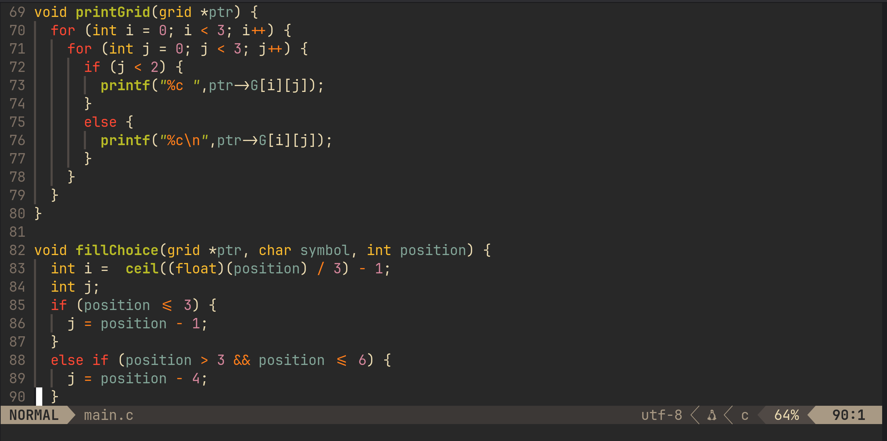
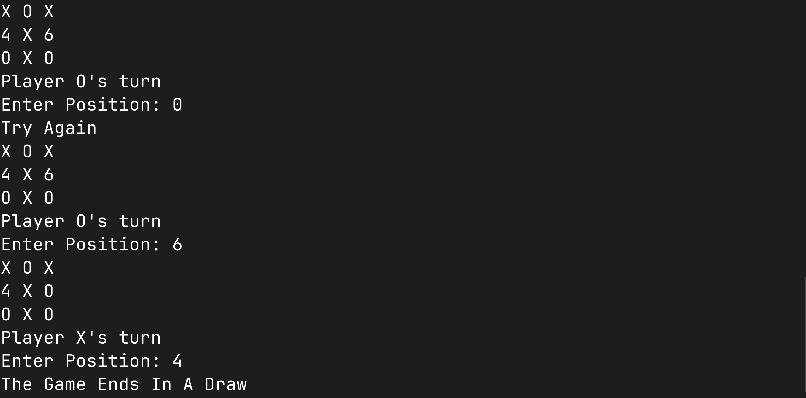

# tictactoe
A simple collection of functions written in C to implement Tic Tac Toe in the CLI.
## Code Preview

## Features
- Custom datatype to manage the playing grid
- System to check the if a player won
## Output Preview

## Usage
Code to get started with game:
(save it as main.c)
```
#include "tictactoe.h" // import the library
#include <stdio.h>
int main(void) {
  grid playingGrid;
  game(&playingGrid);
  return 0;
}
```
To run: 
```
gcc -std=c23 -Wall -Wextra -lm main.c -o main && ./main
```
